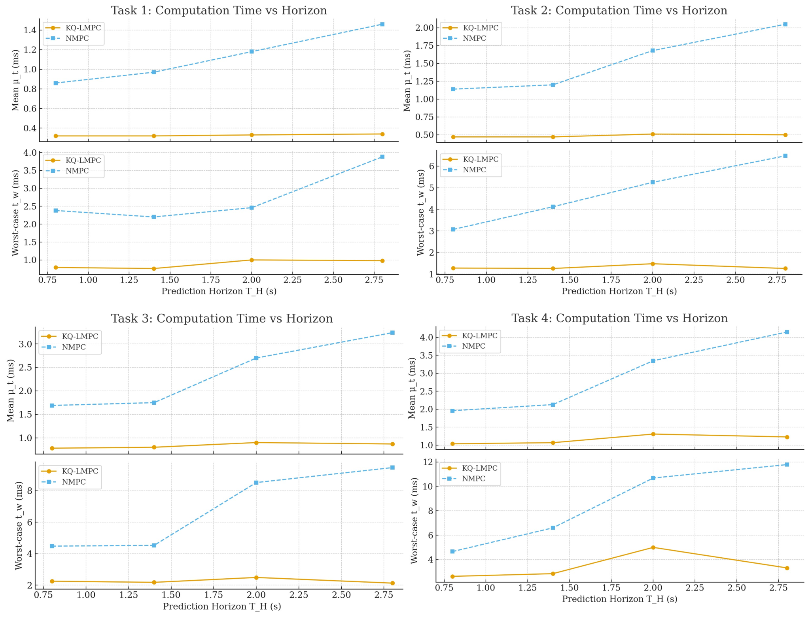
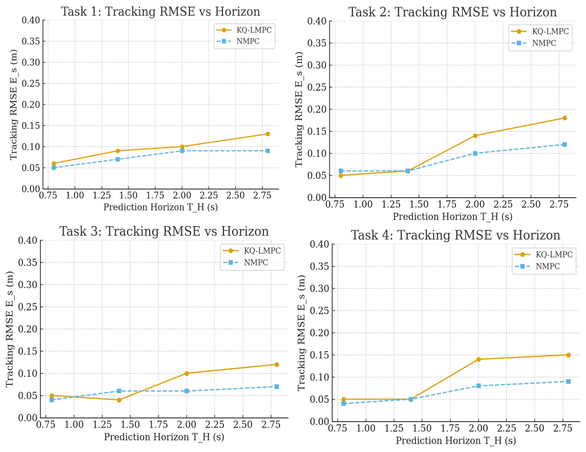

# 🚁 🛸 **KQ-LMPC: Koopman LMPC for Quadrotors**

 > 🚀 **KQ-LMPC is the fastest open-source Koopman MPC controller for quadrotors: zero training data, fully explainable, hardware-proven SE(3) control.** 
 
 > ⚡ Real-time convex MPC (<10 ms) • ✅ Stability guarantees • 🔧 PX4/ROS2 ready

 [](https://pypi.org/project/kq-lmpc-quadrotor/)
[](LICENSE)
[]()
[](https://www.researchgate.net/publication/396545942_Real-Time_Linear_MPC_for_Quadrotors_on_SE3_An_Analytical_Koopman-based_Realization)
[](https://doi.org/10.5281/zenodo.17393835)
[]()


<h4><code>kq_lmpc_quadrotor</code> — A **hardware-ready Python package** for **Koopman-based Linear Model Predictive Control (LMPC)**. Built for **real-time flight**, powered by **analytical Koopman lifting** (no neural networks, no learning phase).</h4>


<p align="center">
  <a href="https://github.com/santoshrajkumar/kq-lmpc-quadrotor">
    
  </a>
</p>


<p align="center">
  ✅ First hardware-validated Koopman MPC on SE(3)  
  ✅ Convex QP (<10 ms solve time) via acados  
  ✅ PX4/ROS2/MAVSDK compatible : deploy to drones easily  
</p>


<div align="center">

🔧 **acados-powered QP** 
 | 🧭 **LPV + LTI Koopman Embedding**
 | 🚀 **PX4 Offboard Ready**

</div>


<table align="center">
  <tr>
    <td>
      
    </td>
    <td>
      
    </td>
  </tr>
</table>

<p align="center">
  
  
  
  
  
  
  
  </a>
</p>
</div>


## 🌟 Key Features

✅ **Analytical Koopman lifting** with **generalizable observables**  
&nbsp;&nbsp;&nbsp;&nbsp;→ No neural networks, no training, no data fitting required  

✅ **Data-free Koopman-lifted LTI + LPV models**  
&nbsp;&nbsp;&nbsp;&nbsp;→ Derived directly from **SE(3) quadrotor dynamics** using Lie algebra structure  

✅ **Real-time Linear MPC (LMPC)**  
&nbsp;&nbsp;&nbsp;&nbsp;→ Solved as a **single convex QP** termed **KQ-LMPC**  
&nbsp;&nbsp;&nbsp;&nbsp;→ < **10 ms** solve time on **Jetson NX / embedded hardware**  

✅ **Trajectory tracking on SE(3)**  
&nbsp;&nbsp;&nbsp;&nbsp;→ **Provable controllability** in lifted Koopman space  

✅ **Closed-loop robustness guarantees**  
&nbsp;&nbsp;&nbsp;&nbsp;→ **Input-to-state practical stability (I-ISpS)**  

✅ **Hardware-ready integration**  
&nbsp;&nbsp;&nbsp;&nbsp;→ Works with **PX4 Offboard Mode**, **ROS2**, **MAVSDK**, **MAVROS**  

✅ **Drop-in MPC module**  
&nbsp;&nbsp;&nbsp;&nbsp;→ for both KQ-LMPC, NMPC with acados on Python.

## ❗ Why It Matters
Real-time control of agile aerial robots is still dominated by **slow NMPC** or **black-box learning-based controllers**. One is too **computationally heavy**, the other is **unsafe without guarantees**.

**KQ-LMPC bridges this gap** by enabling **convex MPC for nonlinear quadrotor dynamics** using Koopman operator theory. This means:
✅ **Real-time feasibility (<10 ms solve time)**  
✅ **Explainable, physics-grounded control**  
✅ **Robustness guarantees (I-ISpS)**  
✅ **Ready for PX4/ROS2 deployment**


## 🧠 Paper

This work is based on:

> **"Real-Time Linear MPC for Quadrotors on SE(3): An Analytical Koopman-based Realization"**  
> *IEEE Robotics and Automation Letters (RA-L), 2025* (To appear)  
> **Santosh Rajkumar**, Chengyu Yang, Yuliang Gu, Sheng Cheng, Naira Hovakimyan, Debdipta Goswami  
> [[Paper PDF]](media/paper.pdf) • [[ArXiv]](https://arxiv.org/abs/2409.12374) • [[Video Demos]](https://soarpapers.github.io/)

If you use this repository, **please cite us** 🙏

```bibtex
@article{rajkumar2025kqlmpc,
  title={Real-Time Linear MPC for Quadrotors on SE(3): An Analytical Koopman-based Realization},
  author={Rajkumar, Santosh and Yang, Chengyu and Gu, Yuliang and Cheng, Sheng and Hovakimyan, Naira and Goswami, Debdipta},
  journal={IEEE Robotics and Automation Letters},
  year={2025}
}
```
## 🔧 Installation

*Virtual environment recommended

Install from PyPI (recommended):

```bash
pip install kq-lmpc-quadrotor
```

Install from source

```bash
git clone https://github.com/santoshrajkumar/kq-lmpc-quadrotor.git
cd kq-lmpc-quadrotor
pip install -e .
```

## ⚡ Quick Demo
```bash
from kq_lmpc_quadrotor import lqr_demo
lqr_demo()
```
<p align="center">
  <a href="https://colab.research.google.com/github/santoshrajkumar/kq-lmpc-quadrotor/blob/main/examples/Notebooks/quick_demo.ipynb">
    
  </a>
</p>


### ⚠️ **Important Dependency Notice**
* This package relies on **acados** for fast Model Predictive Control (MPC).  
* You must configure **acados + Python interface** before running MPC examples.
* Recommended that you install acados and configure, before installing the package if you are going to use MPC.
* Koopman Lifting and LQR will work without acados installation
 * **Quick Setup Checklist**
 - Install acados ✅
 - Enable Python interface ✅
 - Export `ACADOS_SOURCE_DIR` ✅
 - Set library paths:
   - Linux: `LD_LIBRARY_PATH`
   - macOS: `DYLD_LIBRARY_PATH`

* 📚 Install acados: https://docs.acados.org/installation/index.html  
* 🐍 acados Python Interface: https://docs.acados.org/python_interface/index.html  
* 💻 OS Support: **Linux/macOS** (*Not tested on Windows*)

```bash
from kq_lmpc_quadrotor import kqlmpc_demo
kqlmpc_demo()
```

## ⤴️ Koopman Lifting

<p align="center">
  <a href="https://colab.research.google.com/github/santoshrajkumar/kq-lmpc-quadrotor/blob/main/examples/Notebooks/koopman_lifting.ipynb">
    
  </a>
</p>

<p align="center">
  <a href="https://github.com/santoshrajkumar/kq-lmpc-quadrotor/tree/main/MATLAB">
    
  </a>
</p>

## 📊 Benchmarking: KQ-LMPC vs NMPC

* Python 3.10 • Ubuntu 22.04 • AMD Ryzen 3 PRO CPU  
* Metrics: **Mean solve time** (μₜ), **Worst-case solve time** (tᵥ), and **Tracking RMSE** (𝓔ₛ).  
* Prediction horizon **Tₕ ∈ {0.8, 1.4, 2.0, 2.8} s** across **4 tasks**.
* 4 Benchmark Tasks:
  - Task 1 : Follow a Line and Hover
  - Task 2 : Follow a vertically moving helical path.
  - Task 3 : Follow a lemniscate trajectory
  - Task 4 : Follow a knot trajectory.


<center>
<figure style="display:inline-block;margin:0">
  
  <figcaption style="font-size:0.9em;color:#666;text-align:center;margin-top:6px">
    Computation time comparison (ms)
  </figcaption>
</figure>
</center>

<br>

<center>
<figure style="display:inline-block;margin:0">
  
  <figcaption style="font-size:0.9em;color:#666;text-align:center;margin-top:6px">
    Tracking RMSE (m) comparison
  </figcaption>
</figure>
</center>

### 🔍 Highlights

- ✅ **2–4× faster mean computation time** than NMPC  
- ✅ **Lower worst-case latency** → more reliable for real-time flight  
- ✅ **Competitive tracking accuracy**  
- ✅ **Scales efficiently** with larger prediction horizons

---

🚀 **v2.0 (Coming Soon)**  
🔧 **Complete PX4 Offboard control pipeline for hardware**  
🔧 **Full Gazebo SITL + PX4 integration demos**    
🔧 **Flight-ready example configs**

If you find this project useful, please ⭐ star the repo and follow — your support drives development!

<p align="center">
  <a href="https://twitter.com/intent/tweet?text=Real-time%20Koopman%20MPC%20for%20quadrotors!%20%F0%9F%9A%81%20Convex%20QP%20MPC%20on%20SE(3)%2C%20no%20neural%20networks.%20Check%20this%20open%20source%20project%20by%20%40SantoshRajkumar%20&url=https://github.com/santoshrajkumar/kq-lmpc-quadrotor">
    
  </a>
  <a href="https://www.linkedin.com/sharing/share-offsite/?url=https://github.com/santoshrajkumar/kq-lmpc-quadrotor">
    
  </a>
</p>
